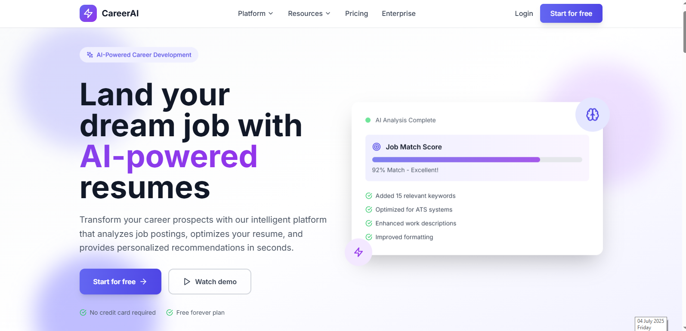

# CareerAI

<div align="center">
  
  
  [](https://reactjs.org/)
  [](https://www.typescriptlang.org/)
  [](https://tailwindcss.com/)
  [](https://vitejs.dev/)
</div>

## 🚀 AI-Powered Career Development Platform

[](https://github.com/MahmoudElhefnawyy/AI-Powered_Career_Developement_Platform)

CareerAI is an innovative platform that leverages artificial intelligence to provide personalized career guidance, skill assessments, and job matching.

## 🌟 Features

- **AI Career Path Recommendations** 🧠
- **Personalized Skill Analysis** 📊
- **Intelligent Job Matching** 🔍
- **AI-Optimized Resume Builder** ✍️
- **Interview Simulation** 💬
- **Career Progress Dashboard** 📈

## 🛠 Tech Stack

```typescript
const techStack = {
  frontend: {
    framework: "React 18",
    language: "TypeScript 5",
    styling: "Tailwind CSS 3",
    stateManagement: "Redux Toolkit",
    routing: "React Router 6"
  },
  backend: {
    aiService: "OpenAI API",
    database: "Firebase/Firestore"
  },
  devTools: {
    bundler: "Vite",
    testing: ["Jest", "React Testing Library"],
    linting: ["ESLint", "Prettier"]
  }
}
